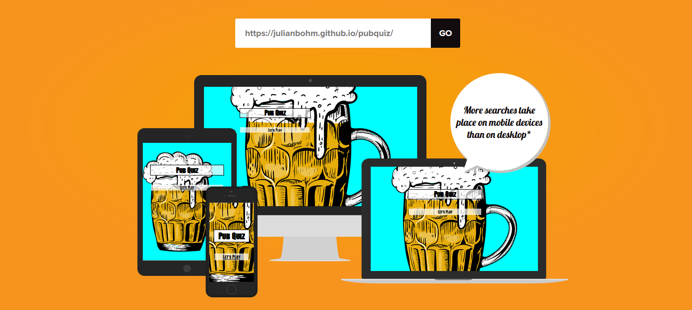
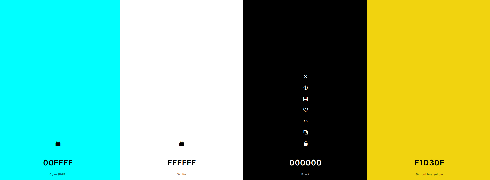
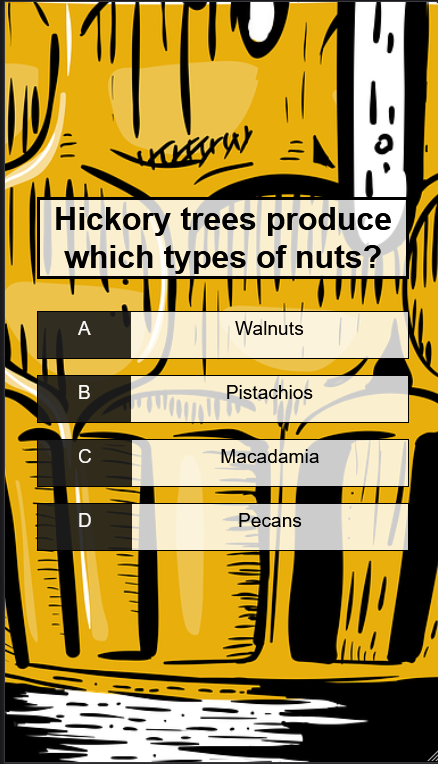

<h1 align="center">Pub Quiz</h1>

## Description 

The goal of this project is to simulate a pub quiz game, asking random questions on many different topics, to compete with friends and have a good time, the game asks a round of questions, 5 questions each time, giving 10 points for correct question and 0 points for incorrect answers, the result of the answers is not seen until the end of the game, where it is known how many questions were correct. 

## Design 

- __Color Pallete__ 
    - the proyect have strong retro colors, to recreate the feeling of 90 vibes, comics, pop art. 
    - the background is aqua color and a beer image that is mainly dark yellow, and this color make good contrasto to the black and white of the questions.   
    

- __Typography__
    -Anton SC google font will be used for throughout the site, and it will fall back to san serif if the web browser can't render it on the site. 
    -Anton SC has the feel of old newspaper comic that give the visitor the nostalgia factor of the old comics.

## Features
In this section, the features that have been implemented on the site will be explained.

- __Rules__ 
    - The rules are simple, the is no limit time to answer, 
    - The visitor has only one chance to get the answer correct, 

    

   

- __Game Buttons__
    - On the Welcome page, there is the Let's Play button, to begin that thake the user to the game page where the game begin.
        
      

- __Game Area__
    -

- __Game Result__
   
)

## Testing 

- HTML Validator and CSS Validator
    - Both pass with out any obsevation,  
    
    
    
    

- JavaScript Check
    - This javascript has a recurent errors, was the use of [] Braquets instead of the more clear dot notatios, after correcting it, the where no more errors.
 

- Accessibility 

    - Welcome Menu

        

    - Game Area

        

- Mobile Responsiveness
    - The lowest to highest maximum screen width for responsive design was done from 330px to 1200px.   
    - Mobile responsiveness was decided to use 330 because that is the norm of the..........

## Bugs

| Bug | Solution |
| --------------- | --------------- |
| 1. Botton with JavaScript to start de game again, did not work after deployment.  | After a lot of try and error, I decided to change plans and use HTML anchor tag to fix it.
| 2.  |  |
| 3.  |  |
| 4.  |  |
| 5.  |  |
| 6.  |  | 

## Deployment

The Pub Quiz was deployed on GitHub page.

- Here are steps  followed to deploy my site:
    - In your GitHib repository, click the 'setting'.
    - left menu and select 'Pages'
    - Source section drop-down menu, select 'Main Branch' and 'Save'
    - After a successful save, the GitHub section will display a message to inform you that the site is ready to be published at https://julianbohm.github.io/pubquiz/game.html

## Credit

### Media

-   The background image  was taken from [Pixabay](https://pixabay.com/)
-   The Favicon in the Title of the page was taken from [Favicon](https://favicon.io/)
 -  A Youtube Javascript tutorial video created by [James Q Quick](https://www.youtube.com/watch?v=rFWbAj40JrQ&list=PLB6wlEeCDJ5Yyh6P2N6Q_9JijB6v4UejF) He was a great source of inspiration and source of information.   
 
 ### Sources of inspiration

    - Code Institute Love Maths proyect.
    -My mentor, Spence, help me understand and correct path when necesary, support and feedback. 
    - Code Institute Tutors, they will allways help me to find the  path.
    - [W3Schools](/https://www.w3schools.com/)
    -all the teammates from my course , allways giving advice and and support for newbies like me.

