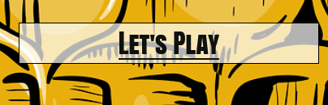
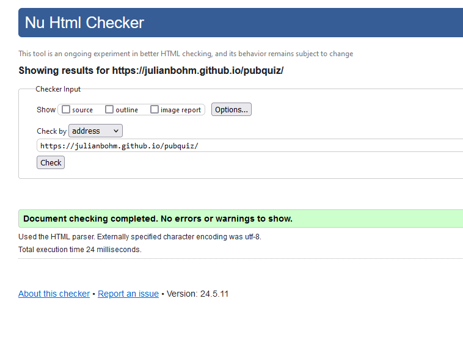
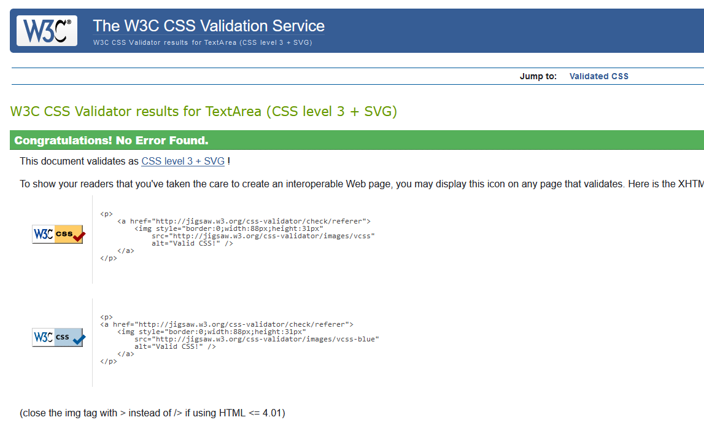
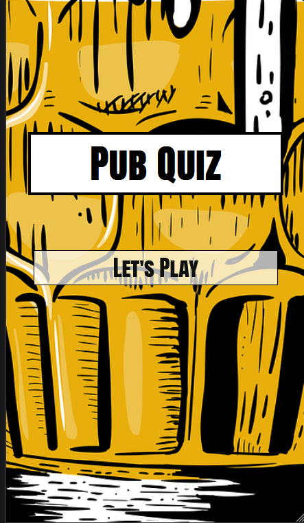

<h1 align="center">Pub Quiz</h1>

## Table of Content

- [Description](#description)
- [Design](#design)
- [Features](#features)
- [Testing](#testing)
- [Bugs](#bugs)
- [Deployment](#deployment)
- [Credits](#credits)

---

## Description 

The goal of this project is to create a fun pub quiz game. Players can compete with friends by answering random questions on different topics. The game has rounds, and in each round, 5 random questions are asked. For every correct answer, the player gets 10 points. If the answer is wrong, they get 0 points. Players won't know if their answers are right or wrong until the end of the game. At the end, the game shows how many questions were answered correctly, and the total score is given. The idea is to have a good time with friends and see who knows the most. 

---

## Design 

- __Color Pallete__ 
    - the proyect have strong retro colors, to recreate the feeling of 90 vibes, comics, pop art. 
    - the background is aqua color and a beer image that is mainly dark yellow, and this color make good contrasto to the black and white of the questions.   
    

- __Typography__
    -Anton SC google font will be used for throughout the site, and it will fall back to san serif if the web browser can't render it on the site. 
    -Anton SC has the feel of old newspaper comic that give the visitor the nostalgia factor of the old comics.

---

## Features

### Game Features
In this section, the features that have been implemented on the site will be explained.

- __Rules__ 
    - There is no time limit to answer the questions, allowing players to think carefully. 
    - Players have only one chance to answer each question correctly. Once answered, they cannot go back or change their response. 

      

- __Game Buttons__
    - On the Welcome page, there is the Let's Play button, to begin that thake the user to the game page where the game begin.
        
      

- __Game Area__
    - The game area displays one question at a time with multiple-choice options. Once a player selects their answer, they move to the next question.
    - The layout is clean and intuitive, making it easy for players to navigate between questions and interact with the quiz.

- __Game Result__
    - At the end of the game, a summary is shown that displays how many questions the player answered correctly out of the 5 presented.
    - The total score is displayed, along with a message encouraging the player to try again or share their results with friends.

### Future Features

- __Timer for Each Question__
    - Add a countdown timer to each question to increase the challenge. Players would have a limited amount of time (e.g., 10 seconds) to answer each question before moving on to the next one automatically.
- __Leaderboard System__
    - Implement leaderboard, where players can save their scores and compare their results with friends or other players. 
- __Difficulty Levels__
    - Add different difficulty levels (Easy, Medium, Hard). The difficulty can be based on the complexity of the questions or by introducing penalties for incorrect answers at harder levels.
- __Audio and Visual Feedback__ 
    - Add audio effects (e.g., a correct answer "ding" or incorrect answer "buzz") and animations to make the game more interactive and engaging.
---

## Testing 

- __HTML Validator and CSS Validator__
    - Both the HTML and CSS files passed through validators without any errors or warnings.
  
    
    
    
    

- __JavaScript Check__
    - Initially, JavaScript errors were encountered due to using square brackets [] instead of the clearer dot notation. After correcting this, the code ran smoothly without errors.
 

- __Accessibility__ 
    - The site was checked for accessibility issues. Features like sufficient color contrast, clear typography, and well-labeled buttons were implemented to ensure an inclusive experience.

    - __Welcome Menu__

        

    - __Game Area__

        

- Mobile Responsiveness
    - The site was tested for responsiveness across a variety of screen sizes, ranging from 330px (for smaller mobile devices) to 1200px (large desktops).   
    - A mobile-first approach was used to ensure the site looks and functions well on all device sizes, including smartphones, tablets, and desktops.

---

## Bugs

| Bug | Solution |
| --------------- | --------------- |
| 1. Images from background do not loading  |Path was corrected  |
| 2. Botton with JavaScript to start de game again, did not work after deployment.  | After a lot of try and error, I decided to change plans and use HTML anchor tag to fix it.
| 3. Game options would overlap on small screens.  | CSS media queries were added to adjust the layout and font size for smaller screen widths. |
| 4. The Let’s Play button was misaligned on mobile.  | Padding and margins were adjusted using media queries to center the button correctly on all screen sizes. |

 

---

## Deployment 

### Deployment
The Pub Quiz game was deployed using GitHub Pages. Below are the steps followed to deploy the site:

1. Go to your GitHub repository and click on the Settings tab.
2. On the left-hand menu, find and select Pages.
3. In the Source section, use the drop-down menu to select Main Branch as the branch to deploy from.
4. Click Save.
5. After saving, GitHub will display a message confirming that your site has been successfully published. The live site can be 5. accessed at: https://julianbohm.github.io/pubquiz/game.html.

### Clone
To clone this repository to your local machine, follow these steps:

1. Go to the repository page on GitHub.
2. Click the Code button (green) at the top of the repository.
3. In the dropdown, choose HTTPS and copy the link provided.
4. In IDE open your Git Bash.
5. Enter the command git clone followed by the copied URL.

---

## Credits

__Media__

- The background image  was taken from [Pixabay](https://pixabay.com/)
- The Favicon in the Title of the page was taken from [Favicon](https://favicon.io/)
- A Youtube Javascript tutorial video created by [James Q Quick](https://www.youtube.com/watch?v=rFWbAj40JrQ&list=PLB6wlEeCDJ5Yyh6P2N6Q_9JijB6v4UejF) He was a great source of inspiration and source of information.   
 
__Sources of inspiration__

- Code Institute Love Maths proyect.
- My mentor, Spence, help me understand and correct path when necesary, support and feedback. 
- Code Institute Tutors, they will allways help me to find the  path.
- [W3Schools](/https://www.w3schools.com/) as my tutorial source, and clear examples.
- All the teammates from my course , allways giving advice and and support for newbies like me.

